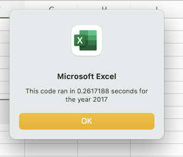
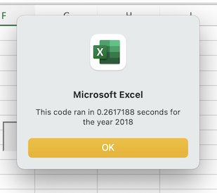
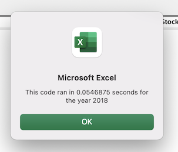

# Stock-Analysis  

## Overview of Project

### Purpose 

The purpose of this project is to create a worksheet using VBA to find the return of investment in stocks of the years of 2017 and 2018, and then refactor this code, in order to determine whether the process of refactoring successfully makes the VBA script run faster.

## Results

After the worksheet was crated it was possible to analyze the return of investments made in 2017 and 2018. 

### Volume and Return of Investment Results 2017

For the year of 2017, good news is that 11 out of 12 tickers had positive returns on investment. Where the DQ ticker had a return of 199.4%, putting it on the top performer of 2017. It is worth mentioning though that DQ had the lowest amount of daily trade volume of all 12.
On the other hand as shown on the image above, TERP was the only one that had a negative return on the investment, which was -7,2%. 

### Volume and Return of Investment Results 2018

For the year of 2018, the performance overall wasn't so good, where only 2 out of the 12 tickers had positive returns. As we can see bove, these tickers were ENPJ and RUN, where the first one had a return of 81.9% and the second had 84%, they are also among the ones that had the highest amount of total daily volume of 2018.

### Volume and Return of Investment Results 

### Results Variance Between 2017 and 2018

Now comparing the difference on the results of both years, we can see that only RUN and TERP out of the 12 tickers had an increase in their return from 2017 to 2018. 

RUN had an increase of 78.5% making it the ticker with the highest return difference. Its total daily volume also increased by 87.8% from 2017 to 2018.

TERP had a slight increase of 2.2% in return of investment, and 8.6% of its total daily volume. But none of those were enough to bring its return on investment to a positive number on the second year.

Another ticker worth mentioning is ENPH, even though it brought a positive return overall, there was a significant decline of 47.6% while its total daily volume increased 173.9% from 2017 to 2018.

### Performance Measure Result 

 In order to get the measurement of the performance, a button was added to the spreadsheet so when the user clicks on it, it displays an input box where the desired year can be inserted. Where the result shown on the box was recorded by taking screenshots of each of the years before and after the code was refactored. 

As presented on the images below the refactored code successfully run faster than the original VBA script.

### Original VBA Transcript

The images below represent the performance measure of the code running results for the years of 2017 and 2018 on the original VBA transcript, before it was refactored. 

### Refactored VBA Transcript 

The images below represent the performance measure of the code running results for the years of 2017 and 2018 after the code was refactored.

## Summary 

1. What are the advantages or disadvantages of refactoring code?

- Refactoring code has many advantages such as using less memory, taking fewer steps and making the code better and more readable for future users, making the code more efficient in general.

- On the other hand refactoring code has a couple of disadvantages too, such as the fact that it could take a lot of time as you sometimes don't know what you may find along the process, also you may end up accidentally adding new errors to the code.

2. How do these pros and cons apply to refactoring the original VBA script?

- All of the pros above were seen on the process of refactoring the original VBA script, since now the code runs faster and is more readable, since for example the fact that more comments were added, and overall the code is more efficient.

- One of the cons was reflected on refactoring the original VBA Scrip, as the process did take some time to be completed. So I can imagine that for other codes that are less well structured it would take a long time to understand and do the refactoring.

